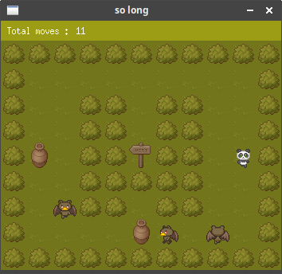
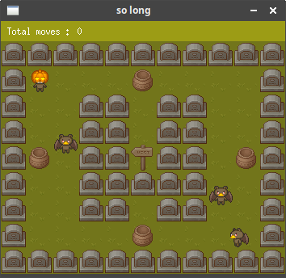

# Welcome to so long 🐼

This project is about creating a mini game using MinilibX.
MinilibX, a simple X-Window (X11R6) programming API in C, designed for 42 students, suitable for X-beginners.

Using the library, the objective of this project is to learn how to create a game board, drawing sprintes, handling events to move and animate the sprites, and managing the game parameters all along the session.

## Installation

Clone the repository:
```sh
git clone git@github.com:twagger/so_long.git
```
Make to create the **mandatory** so_long program:
```sh
make
```
Make bonus to create the so_long program **with bonuses** (animation, score on screen, enemies):
```sh
make fclean
make bonus
```

## Usage

### Game goal and controls
In this game, you control a little panda 🐼 that must collect all bamboo juice pots 🍯 and escape with the exit 🔚  panel.

**make sure you are in QWERTY mode so it is more comfortable !**  
⬆️ W  
➡️ D  
⬇️ S  
⬅️ A  


## Minimum game

In 42 School, for most project you have a **mandatory part**, which is supposed to help you understand and practice the main notions of the project. This mandatory part is quite basic but working :)
```sh
make re
./so_long maps/simple1.ber
```


## Full game

You have to compile the program with the bonuses to launch the full game.
```sh
make fclean
make bonus
./so_long maps/patrol3.ber
```
 The improvements are :
* The little panda is animated
* You can have some enemies patroling in some maps
* Your current score is displayed on the game window



## Options

Two options are available for the game. Both of them must be specified with the **make** command.

### Speed management

Depending on the available resources on your computer, the game frame rate cannot be the same. If the game is too slow or too fast, you can try to change the speed with the command :
```sh
make fclean
make bonus SPEED=15
./so_long maps/patrol3.ber
```
*The higher the number is, the **slowest** the game is.*

### Themes

One theme is available : Halloween theme
```sh
make fclean
make bonus HALLOWEEN=true
./so_long maps/patrol3.ber
```


## Author

👤 **Thomas WAGNER**

* Github: [@twagger](https://github.com/twagger/)

## Game resources

* Visual assets (bushes, ground, pots, ...) : https://cainos.itch.io/pixel-art-top-down-basic
* Panda and enemies : https://pipoya.itch.io/pipoya-free-rpg-character-sprites-32x32