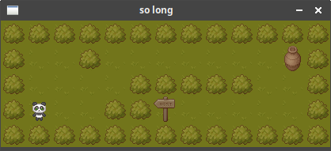

# Welcome to so long 👋

This project is about creating a mini game using MinilibX.
MinilibX, a simple X-Window (X11R6) programming API in C, designed for 42 students, suitable for X-beginners.

Using the library, the objective of this project is to learn how to create a game board, drawing sprintes, handling events to move and animate the sprites, and managing the game parameters all along the session.

## Installation

Clone the repository:
```sh
git clone git@github.com:twagger/so_long.git
```
Make to create the **mandatory** so_long program:
```sh
make
```
Make bonus to create the so_long program **with bonuses** (animation, score on screen, enemies):
```sh
make fclean
make bonus
```

## Usage

### Game goal and controls
In this game, you control a little panda 🐼  that must collect all bamboo juice pots 🍯  and escape with the exit 🔚  panel.

**make sure you are in QWERTY mode so it is more comfortable !**  
⬆️  W  
➡️ D  
⬇️ S  
&#FE0F A  


### Minimum game

In 42 School, for most project you have a **mandatory part**, which is supposed to help you understand and practice the main notions of the project. This mandatory part is quite basic but working :)
```sh
./so_long maps/simple1.ber
```


```sh
gcc main.o libftprintf.a
```

## Author

👤 **Thomas WAGNER**

* Github: [@twagger](https://github.com/twagger/)